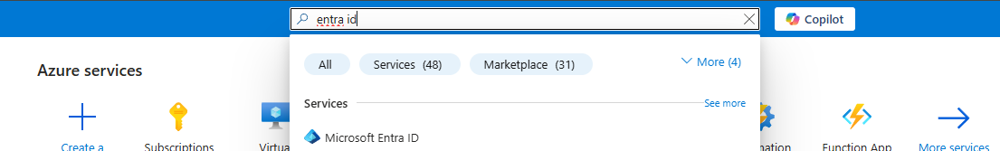
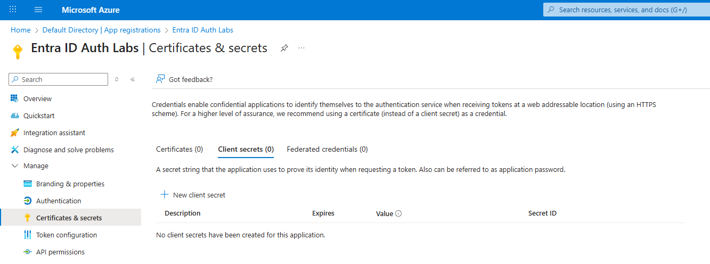
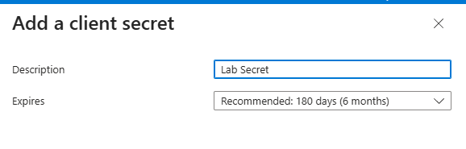

# Lab 1: Authentication with Microsoft Entra ID

**Duration:** 25-30 minutes  
**Difficulty:** Beginner

## 🎯 Learning Objectives

By the end of this lab, you will:
- Create and configure an application registration in Microsoft Entra ID
- Understand how authentication works with Microsoft Entra ID
- Distinguish between ID tokens and access tokens
- Explore token claims and their purposes
- Learn to troubleshoot common authentication errors

## 📋 Prerequisites

- .NET 8 SDK installed
- Project cloned and built (`dotnet restore && dotnet build`)
- Access to Azure Portal with permissions to create app registrations
- A Microsoft Entra ID tenant (free tier is sufficient)

## 🚀 Lab Steps

### Step 0: Create and Configure App Registration (10-12 minutes)

In this step, you'll create an **App Registration** in Microsoft Entra ID. This represents your application's identity in Azure and defines how users authenticate to your app.

**🎓 What is an App Registration?**
An App Registration is a configuration in Entra ID that:
- Gives your application an identity (Client ID)
- Defines who can sign in (single tenant, multi-tenant, personal accounts)
- Specifies where users are redirected after authentication (Redirect URIs)
- Declares what permissions your app needs (API permissions)

---

#### Part A: Create the App Registration

1. **Navigate to Azure Portal:**
   - Open [https://portal.azure.com](https://portal.azure.com)
   - Sign in with your Azure account

2. **Open Microsoft Entra ID:**
   - In the search bar at the top, type **"Microsoft Entra ID"**
   - Click on **Microsoft Entra ID** in the results

   

3. **Navigate to App Registrations:**
   - In the left navigation menu, expand **Manage** and then click **App registrations**
   - Click **+ New registration** button at the top

   

4. **Configure Registration Details:**

   Fill in the registration form:

   | Field | Value | Why? |
   |-------|-------|------|
   | **Name** | `Entra ID Auth Labs` | Display name shown during consent |
   | **Supported account types** | **Accounts in this organizational directory only** | Single-tenant app - only your organization's users can sign in |
   | **Redirect URI** | Platform: **Web**<br>URI: `https://localhost:7001/signin-oidc` | Where Entra ID sends users after authentication |

   

   **🎓 Understanding Redirect URIs:**
   - The redirect URI **must match exactly** what your application expects
   - `https://` is required for security (except localhost in development)
   - `/signin-oidc` is the default path for Microsoft.Identity.Web
   - Mismatches cause error **AADSTS50011**

5. **Complete Registration:**
   - Click **Register** button
   - You'll be taken to the app's **Overview** page

---

#### Part B: Copy Configuration Values

On the Overview page, you'll see important identifiers for your application:


1. **Copy the Application (client) ID:**
   - Find **Application (client) ID** on the Overview page
   - Click the copy icon next to it
   - Paste it somewhere safe (you'll need it in a moment)
   - **Example format:** `12345678-1234-1234-1234-123456789abc`

2. **Copy the Directory (tenant) ID:**
   - Find **Directory (tenant) ID** on the Overview page
   - Click the copy icon
   - Save this as well
   - **Example format:** `87654321-4321-4321-4321-cba987654321`

3. **Create a Client Secret:**
   - In the left navigation menu, expand **Manage** and click **Certificates & secrets**
   - Under **Client secrets**, click **+ New client secret**
   
   
   
   - Enter a **Description**: `Lab Secret`
   - Select **Expires**: `6 months` (recommended for training)
   - Click **Add**
   
   
   
   - **⚠️ IMPORTANT:** Immediately copy the **Value** (not the Secret ID)
   - The value will only be shown once - it disappears after you leave this page
   - Save this value securely (you'll need it in the next step)
   
   

**🎓 Understanding These IDs:**
- **Client ID:** Uniquely identifies your application (like a username)
- **Tenant ID:** Identifies your organization's Entra ID directory
- **Domain:** Your organization's domain in Entra ID
- **Client Secret:** Proves your app's identity when requesting tokens (like a password)

---

#### Part C: Configure the Application

Now you'll configure your local application with these values.

1. **Open the Application Configuration File:**
   - Navigate to: `src/WebAuthzDemo/appsettings.json`
   - Open it in your code editor

2. **Update the AzureAd Section:**

   Replace the placeholder values:

   ```json
   {
     "AzureAd": {
       "Instance": "https://login.microsoftonline.com/",
       "TenantId": "YOUR_TENANT_ID",
       "ClientId": "YOUR_CLIENT_ID",
       "ClientSecret": "YOUR_CLIENT_SECRET",
       "CallbackPath": "/signin-oidc"
     }
   }
   ```

   **Replace:**
   - `YOUR_TENANT_ID` → Directory (tenant) ID you copied
   - `YOUR_CLIENT_ID` → Application (client) ID you copied
   - `YOUR_CLIENT_SECRET` → Client secret value you copied in Part B

   **Keep unchanged:**
   - `Instance` - The Microsoft login endpoint
   - `CallbackPath` - Must match the path in your redirect URI

3. **Save the File**

   **🔒 Security Note:**
   - In production applications, **never commit client secrets to source control**
   - Use Azure Key Vault, environment variables, or secure configuration providers
   - For this training lab, storing in `appsettings.json` is acceptable for learning purposes only

---

#### Part D: Run the Application

1. **Start the Application:**
   ```bash
   cd src/WebAuthzDemo
   dotnet run
   ```

2. **Verify It's Running:**
   - You should see output similar to:
     ```
     info: Microsoft.Hosting.Lifetime[14]
           Now listening on: https://localhost:7001
     ```

3. **Open Your Browser:**
   - Navigate to: **https://localhost:7001**
   - You should see the application home page
   - If your browser warns about the certificate, proceed anyway (this is expected for local development)

   

**✓ Success Indicator:** You see the home page with "Sign In with Microsoft Entra ID" button.

**🎓 Configuration Review:**
At this point, you've:
- ✅ Created an identity for your app in Entra ID (App Registration)
- ✅ Configured where users return after login (Redirect URI)
- ✅ Connected your local app to your Entra ID tenant (Client ID, Tenant ID)
- ✅ Started your application on the expected HTTPS port

---

### Step 1: Initial Sign-In (2 minutes)

1. Open your browser to **https://localhost:7001**
2. You should see the home page with a "Sign In with Microsoft Entra ID" button
3. Click the **Sign In** button
4. Enter your personal Microsoft account (@outlook.com, @hotmail.com) credentials
5. If prompted, accept the consent dialog
6. You should be redirected back to the application

**✓ Success Indicator:** You see your name in the top navigation and a "Welcome" message.

**📝 Note:** The first sign-in may prompt you to consent to the application accessing your profile information.


---

### Step 2: Explore the ID Token (5 minutes)

1. Click **ID Token** in the navigation menu

2. **Observe Token Metadata:**
   - **Issuer (iss):** Should be `https://login.microsoftonline.com/{tenantId}/v2.0`
   - **Audience (aud):** Should match your Application (Client) ID
   - **Expiration:** Typically 1 hour from issue time

3. **Review Key Claims:**
   
   | Claim | Purpose | Example Value |
   |-------|---------|---------------|
   | `sub` | Subject - unique user identifier | `AAAAAAAAAzM...` |
   | `oid` | Object ID in Azure AD | `00000000-0000-0000...` |
   | `tid` | Tenant ID | `{your-tenant-id}` |
   | `name` | User's display name | `John Doe` |
   | `preferred_username` | User's email/UPN | `john@contoso.com` |

4. **Try the JWT.ms Integration:**
   - Click **Open in jwt.ms** button
   - A new tab opens with your token decoded
   - Compare the claims shown in both views

5. **Copy the Token:**
   - Click **Copy Token** button
   - Paste it in a text editor (for later comparison with access token)

**🎓 Teaching Point:**
- ID tokens are meant for the **client application** to verify the user's identity
- The `aud` (audience) claim should match your app's Client ID
- Never send ID tokens to APIs - they're not meant for authorization

---

### Step 3: Acquire and Explore Access Token (5 minutes)

1. Click **Access Token** in the navigation menu

2. **Compare Metadata with ID Token:**
   
   | Property | ID Token | Access Token |
   |----------|----------|--------------|
   | Audience | Your Client ID | `https://graph.microsoft.com` |
   | Purpose | Prove identity | Grant API access |
   | Contains | User profile info | Permissions (scopes) |

3. **Examine the Scopes:**
   - Look for the `scp` claim
   - You should see scopes like: `User.Read`, `openid`, `profile`, `email`
   - These represent **delegated permissions**

4. **Understanding Delegated Permissions:**
   - The user has consented to let the app access Graph on their behalf
   - The token is valid only for the consented scopes
   - Scopes are space-separated in the `scp` claim

5. **Note the Time to Expiration:**
   - Access tokens typically expire in 1 hour
   - The app can use refresh tokens to get new access tokens silently

**🎓 Teaching Point:**
- Access tokens are meant for **resource servers (APIs)**
- The audience is the API (Microsoft Graph in this case)
- Don't use access tokens for user identification - use ID tokens instead

---

### Step 4: View All Claims (2 minutes)

1. Click **Claims** in the navigation menu

2. **Browse All Claims:**
   - Use the search box to filter claims
   - Try searching for: `name`, `email`, `tid`, `scp`

3. **Claims by Category:**
   - Expand each category to see grouped claims
   - **Identity Claims:** User information
   - **Token Claims:** Token metadata
   - **Authorization Claims:** Permissions and roles

4. **Understanding Claim Types:**
   - Standard claims (e.g., `iss`, `aud`, `sub`) are defined by OpenID Connect
   - Custom claims can be added via Azure AD
   - Claims are used for both authentication and authorization

**📝 Activity:** Find the following claims and note their values:
- `oid` (Object ID): _______________
- `tid` (Tenant ID): _______________
- `scp` (Scopes): _______________

---

### Step 5: Error Simulation - Redirect URI Mismatch (Optional, 3 minutes)

This step demonstrates a common authentication error.

1. **Sign Out:**
   - Click **Sign Out** in the navigation

2. **Break the Configuration:**
   - Go to Azure Portal → App registrations → Your app
   - Click **Authentication**
   - Find the redirect URI: `https://localhost:7001/signin-oidc`
   - Change it to: `https://localhost:7001/wrong-path`
   - Click **Save**

3. **Attempt to Sign In:**
   - Return to the application
   - Click **Sign In**
   - You should see error **AADSTS50011**

4. **Observe the Error Page:**
   - The application shows a helpful error message
   - Explains what the issue is and how to fix it

5. **Fix the Configuration:**
   - Return to Azure Portal
   - Change the redirect URI back to: `https://localhost:7001/signin-oidc`
   - Click **Save**
   - Try signing in again - should succeed

**🎓 Teaching Point:**
- Redirect URIs must match **exactly** (protocol, host, port, path)
- This is a security feature to prevent token hijacking
- Always check error codes in Azure AD (AADSTS prefix)

---

## ✅ Lab Completion Checklist

- [ ] Successfully signed in with Microsoft Entra ID
- [ ] Explored ID token and understood its purpose
- [ ] Compared ID token with access token
- [ ] Identified key claims and their meanings
- [ ] Understood the difference between authentication tokens
- [ ] (Optional) Simulated and fixed a redirect URI error

## 🎯 Key Takeaways

### Authentication Concepts

1. **Authentication proves identity**
   - "Who are you?"
   - Uses OpenID Connect protocol
   - Returns ID token with user information

2. **Two Types of Tokens:**
   - **ID Token:** For the client app (audience = your app)
   - **Access Token:** For APIs (audience = the API)

3. **Token Claims:**
   - Key-value pairs of information
   - Used for identity and authorization decisions
   - Standard claims defined by OpenID Connect

4. **Authorization Code + PKCE Flow:**
   - Secure method for web applications
   - User authenticates at Entra ID (not in your app)
   - Tokens exchanged server-side
   - PKCE prevents authorization code interception

### Common Errors

| Error Code | Meaning | Fix |
|------------|---------|-----|
| AADSTS50011 | Redirect URI mismatch | Fix URI in Azure Portal |
| AADSTS700016 | App not found | Check Client ID |
| AADSTS65001 | Consent required | Grant permissions |

---

## 🔄 Next Steps

Proceed to **Lab 2: Authorization** to learn how to:
- Call protected API endpoints
- Implement scope-based authorization
- Implement role-based authorization
- Handle authorization failures

---

## 📚 Additional Resources

- [OpenID Connect Protocol](https://openid.net/connect/)
- [ID Token Claims Reference](https://docs.microsoft.com/azure/active-directory/develop/id-tokens)
- [Access Token Claims Reference](https://docs.microsoft.com/azure/active-directory/develop/access-tokens)
- [JWT.ms Token Decoder](https://jwt.ms)

## ❓ Quiz Yourself

1. What is the purpose of an ID token?
2. What claim in an ID token identifies the user uniquely?
3. What's the difference between `aud` in an ID token vs. an access token?
4. What does the `scp` claim contain?
5. Why should you never send an ID token to an API?

<details>
<summary>Click for Answers</summary>

1. To verify the user's identity to the client application
2. `sub` (subject) or `oid` (object ID)
3. ID token `aud` = your app's Client ID; Access token `aud` = the target API
4. Scopes (delegated permissions) the user has consented to
5. ID tokens are meant for the client; APIs need access tokens with proper audience

</details>

---

**Lab 1 Complete!** ✅

Continue to [Lab 2: Authorization](Lab2_SimpleAuthorization.md) →
