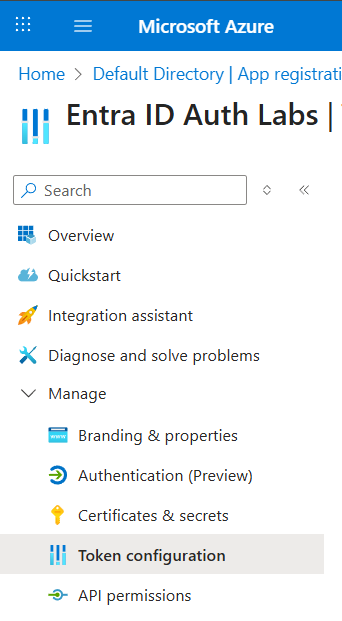
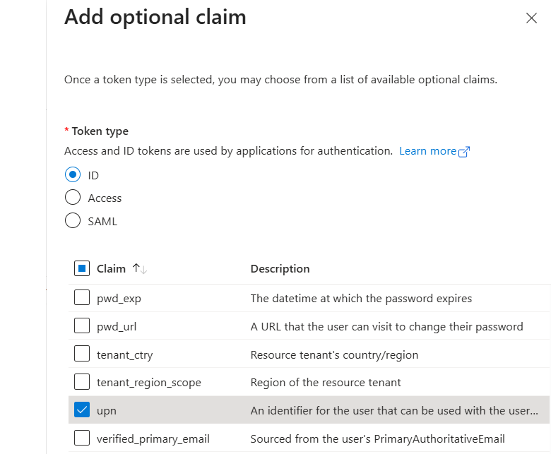
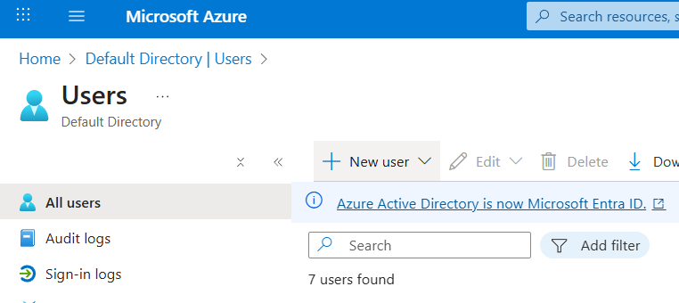
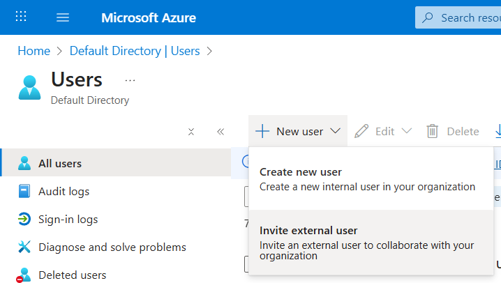
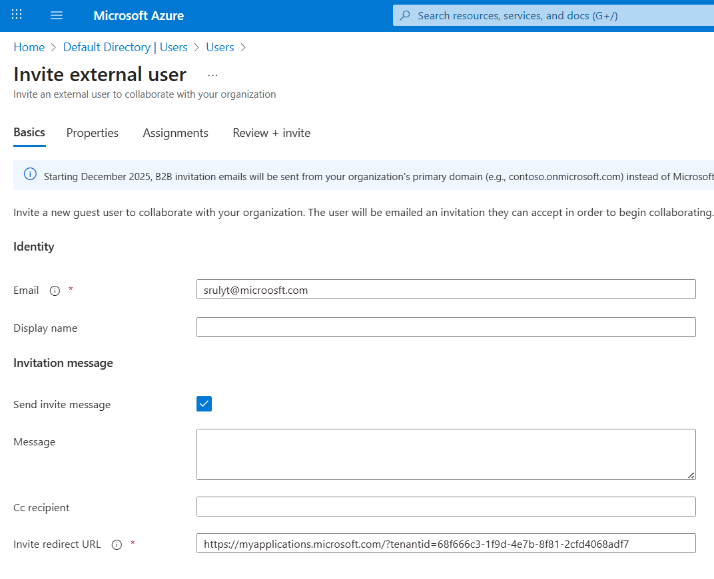

# Lab 6: External Users and Identity Types

**Duration:** 20-25 minutes (+ 10 minutes bonus)  
**Difficulty:** Beginner

## 🎯 Learning Objectives

By the end of this lab, you will:
- Understand the difference between internal (member) and external (guest) users in Microsoft Entra ID
- Recognize how user type affects token claims
- Learn about the `upn` (User Principal Name) claim and why it matters
- Compare authentication behavior across different identity types
- Understand identity provider federation concepts

## 📋 Prerequisites

- Completed Lab 1 (app registration created and configured)
- Access to Azure Portal with permissions to create users
- Access to the Lab 1 application (`src/Module1/WebAuthzDemo`)
- A corporate email address for the bonus section (optional)

## 🎓 Background: Why You're Already an External User

When you created your Azure subscription using the Visual Studio Enterprise benefit, Azure created a new Microsoft Entra ID tenant using your personal Microsoft account (e.g., `yourname@outlook.com`, `yourname@live.com`, `yourname@hotmail.com`).

**Here's the interesting part:** Even though this is "your" tenant, you are actually a **guest user** in it!

### Member vs Guest User Types

Microsoft Entra ID distinguishes between two types of users:

| User Type | Description | Example |
|-----------|-------------|---------|
| **Member** | User account created directly in the tenant | `john.doe@contoso.onmicrosoft.com` |
| **Guest** | User account from another identity provider invited to the tenant | `jane@outlook.com` (invited to contoso tenant) |

**Your current status:** You're a guest user because your identity is managed by Microsoft Account (live.com), not by your tenant's Entra ID directory.

This lab will help you see the difference by creating an internal member user and comparing the authentication claims.

---

## 🚀 Lab Steps

### Step 0: Update App Registration for UPN Claim (5 minutes)

**⚠️ CRITICAL:** This step must be completed **before** any sign-ins in this lab. Existing tokens won't include the new claim.

The `upn` (User Principal Name) claim is essential for this lab but is not included in tokens by default for external users. We need to add it as an optional claim.

#### Part A: Navigate to Token Configuration

1. **Open Azure Portal:**
   - Navigate to [https://portal.azure.com](https://portal.azure.com)
   - Go to **Microsoft Entra ID**

2. **Find Your App Registration:**
   - Click **App registrations** in the left menu
   - Click on **Entra ID Auth Labs** (or whatever you named your Lab 1 app)

3. **Open Token Configuration:**
   - In the left navigation menu, expand **Manage**
   - Click **Token configuration**

   

#### Part B: Add Optional Claim

1. **Add UPN to ID Token:**
   - Click **+ Add optional claim** button
   - Select token type: **ID**
   - In the list of claims, find and check **upn** (User Principal Name)
   - Click **Add**

   

2. **Grant Permissions (if prompted):**
   - If a dialog appears asking about Microsoft Graph permissions
   - Check the box to grant permissions
   - Click **Add**

3. **Verify Configuration:**
   - You should see **upn** listed under "ID" token type
   - The claim should show as **Optional claim**

**🎓 Why This Matters:**
- The `upn` claim shows the user's sign-in name
- For internal users: usually their email-like identifier (e.g., `john@contoso.onmicrosoft.com`)
- For external users: may not be present or may show the guest UPN assigned by the host tenant
- This claim helps applications display the correct user identity

**⚠️ Important:** Sign out completely if you're currently signed in to the Lab 1 application. Existing tokens won't have the new claim.

---

### Step 1: (Optional) Recreate Client Secret (3-5 minutes)

If you lost or can't find the client secret from Lab 1, follow these steps to create a new one.

**Note:** If you still have your original client secret and it's configured in `appsettings.json`, skip to Step 2.

#### Part A: Delete Old Secret (Optional)

1. **Navigate to Certificates & Secrets:**
   - In your app registration, click **Certificates & secrets** (under Manage)
   - Under **Client secrets**, you'll see your existing secret(s)

2. **Delete Old Secret:**
   - Click the **Delete** (trash can) icon next to the old secret
   - Confirm deletion

#### Part B: Create New Secret

1. **Add New Client Secret:**
   - Click **+ New client secret**
   - Enter **Description**: `Lab 6 Secret`
   - Select **Expires**: `6 months`
   - Click **Add**

2. **Copy the Secret Value:**
   - **⚠️ CRITICAL:** Immediately copy the **Value** (not the Secret ID)
   - This value is only shown once and cannot be retrieved later
   - Save it in a secure location

#### Part C: Update Application Configuration

1. **Open Configuration File:**
   - Navigate to: `src/Module1/WebAuthzDemo/appsettings.json`

2. **Update Client Secret:**
   ```json
   {
     "AzureAd": {
       "Instance": "https://login.microsoftonline.com/",
       "TenantId": "your-tenant-id",
       "ClientId": "your-client-id",
       "ClientSecret": "PASTE_NEW_SECRET_HERE",
       "CallbackPath": "/signin-oidc"
     }
   }
   ```

3. **Save the File**

---

### Step 2: Create an Internal User (8-10 minutes)

Now you'll create a user account that's native to your Entra ID tenant (a member user).

#### Part A: Create the User Account

1. **Navigate to Users:**
   - In Azure Portal, go to **Microsoft Entra ID**
   - Click **Users** in the left menu
   - Click **+ New user** at the top
   - Select **Create new user**

   

2. **Configure User Details:**

   Fill in the user creation form:

   | Field | Value | Notes |
   |-------|-------|-------|
   | **User principal name** | `labuser` | Will become `labuser@{yourtenant}.onmicrosoft.com` |
   | **Mail nickname** | `labuser` | Auto-filled |
   | **Display name** | `Lab Test User` | How the name appears in apps |
   | **Password** | Click "Auto-generate password" | Copy this - you'll need it! |
   | **Account enabled** | ✓ Checked | User can sign in |

   **⚠️ Important:** 
   - Copy the auto-generated password before clicking Create
   - The password will be in the format similar to: `Abc12345!@#`
   - You'll need this for the first sign-in

3. **Create the User:**
   - Click **Review + create**
   - Review the details
   - Click **Create**

4. **Verify Creation:**
   - You should see "Successfully created user labuser"
   - The user should appear in your Users list

#### Part B: Prepare for MFA Setup

**🎓 Understanding MFA Requirements:**
Azure now requires Multi-Factor Authentication (MFA) for all users by default. When the new user signs in for the first time, they'll be prompted to:
1. Change their password (from the temporary one)
2. Set up MFA

**What you'll need:**
- The temporary password you copied
- A mobile device for MFA setup (Microsoft Authenticator app)

**Recommendation:** Have your phone ready with the Microsoft Authenticator app installed before proceeding to Step 3.

---

### Step 3: Sign In and Compare Claims (8-10 minutes)

Now you'll sign in with both your Microsoft account and the new internal user to compare their token claims.

#### Part A: Sign In with Your Microsoft Account (External Guest User)

1. **Start the Application:**
   ```bash
   cd src/Module1/WebAuthzDemo
   dotnet run
   ```

2. **Open Browser:**
   - Navigate to: **https://localhost:7001**

3. **Sign In:**
   - Click **Sign In with Microsoft Entra ID**
   - Use your personal Microsoft account (e.g., `yourname@outlook.com`)
   - Complete sign-in

4. **View Claims:**
   - Click **Claims** in the navigation menu
   - Look for these specific claims and record their values:

   **Microsoft Account Claims to Record:**

   | Claim | Your Value | Notes |
   |-------|------------|-------|
   | `upn` | _____________ | May be absent or show guest UPN |
   | `idp` | _____________ | Should show `live.com` |
   | `iss` | _____________ | Token issuer |
   | `tid` | _____________ | Your tenant ID |
   | `oid` | _____________ | Object ID of your guest account |
   | `amr` | _____________ | Authentication method |
   | `name` | _____________ | Display name |
   | `preferred_username` | _____________ | Sign-in identifier |

5. **Take a Screenshot (Optional):**
   - Capture the Claims page for later comparison

#### Part B: Sign In with Internal User

1. **Sign Out:**
   - Click **Sign Out** in the application
   - Ensure you're completely signed out

2. **Sign In with New User:**
   - Click **Sign In with Microsoft Entra ID**
   - Enter username: `labuser@{yourtenant}.onmicrosoft.com`
     - Replace `{yourtenant}` with your actual tenant name
     - Example: `labuser@contoso.onmicrosoft.com`
   - Enter the temporary password you copied earlier
   - Click **Sign in**

3. **Change Password:**
   - You'll be prompted to change your password
   - Enter the temporary password again
   - Create and confirm a new password
   - Click **Sign in**

4. **Set Up MFA:**
   - You'll be prompted: "More information required"
   - Click **Next**

5. **Configure Microsoft Authenticator (Recommended):**
   - Select **I want to set up a different method**
   - Choose **Authenticator app**
   - Follow the prompts to:
     - Install Microsoft Authenticator on your phone (if not already installed)
     - Scan the QR code
     - Approve the test notification
   

6. **Complete Setup:**
   - Click **Done** after MFA is configured
   - You should be redirected back to the application

7. **View Claims:**
   - Click **Claims** in the navigation menu
   - Record the same claims as before:

   **Internal User Claims to Record:**

   | Claim | Your Value | Notes |
   |-------|------------|-------|
   | `upn` | _____________ | Should be `labuser@{tenant}.onmicrosoft.com` |
   | `idp` | _____________ | Should be absent or show tenant issuer |
   | `iss` | _____________ | Token issuer |
   | `tid` | _____________ | Your tenant ID (same as before) |
   | `oid` | _____________ | Different from your guest account |
   | `amr` | _____________ | May include `mfa` |
   | `name` | _____________ | Should be "Lab Test User" |
   | `preferred_username` | _____________ | Should match upn |

   

#### Part C: Compare the Results

Create your own comparison table:

| Claim | Microsoft Account | Internal User | Difference |
|-------|-------------------|---------------|------------|
| `upn` | | | |
| `idp` | | | |
| `oid` | | | |
| `amr` | | | |
| `preferred_username` | | | |

**🎓 Key Observations:**

You should notice:
- **upn claim:** Present and clear for internal user; may be missing or different for Microsoft account
- **idp claim:** Shows `live.com` for Microsoft account; absent for internal user
- **oid claim:** Different values because they're different user objects
- **amr claim:** May include `mfa` for internal user after MFA setup
- **preferred_username:** Clear email format for internal user

---

### Step 4: (Bonus) Invite Corporate Guest User (10 minutes)

This bonus section shows how to invite an external user from a different organization.

#### Part A: Invite Guest User

1. **Navigate to Users:**
   - Azure Portal → Microsoft Entra ID → Users
   - Click **+ New user**
   - Select **Invite external user**

   

2. **Configure Invitation:**

   | Field | Value |
   |-------|-------|
   | **Email address** | Your corporate email (e.g., `you@microsoft.com`) |
   | **Display name** | Your Name (Corporate) |
   | **Send invite message** | ✓ Checked |
   | **Message** | "Test invitation for Entra ID lab" |

**Copy the invite redirect url**

   

3. **Send Invitation:**
   - Click **Invite**
   - The user will receive an email invitation

4. **Accept Invitation:**
   - Check your corporate email inbox
   - Open the invitation email
   - Click **Accept invitation**
   - **If you didn't receive an email** paste the invitation link from step 2 into the browser 
   - Sign in with your corporate credentials if prompted
   - Accept any consent prompts


#### Part B: Sign In with Guest User

1. **Sign Out of Application:**
   - Return to the Lab 1 app
   - Click **Sign Out**

2. **Sign In with Corporate Account:**
   - Click **Sign In**
   - Enter your corporate email address
   - Sign in with your corporate credentials
   - You may need to consent to the application

3. **View Claims:**
   - Click **Claims** in the navigation menu
   - Record the same claims again:

   **Corporate Guest User Claims to Record:**

   | Claim | Your Value | Notes |
   |-------|------------|-------|
   | `upn` | _____________ | May show guest UPN |
   | `idp` | _____________ | Should show your corporate identity provider |
   | `iss` | _____________ | May be your corporate tenant or the host tenant |
   | `tid` | _____________ | Your tenant ID (where you're a guest) |
   | `oid` | _____________ | Different from other accounts |
   | `amr` | _____________ | Depends on corporate auth requirements |
   | `name` | _____________ | From your corporate directory |
   | `preferred_username` | _____________ | Your corporate email |

#### Part C: Three-Way Comparison

Now you have three different user types to compare:

| Claim | Microsoft Account Guest | Internal Member | Corporate Guest |
|-------|-------------------------|-----------------|-----------------|
| `upn` | | | |
| `idp` | `live.com` | (absent) | (your org's IdP) |
| `oid` | | | |
| User Type | Guest | Member | Guest |
| Identity Source | Microsoft Account | This Tenant | Corporate Tenant |

**🎓 Teaching Point:**
- **Guest users** authenticate against their home identity provider (IdP)
- **Member users** authenticate against the host tenant
- All users get tokens from the same tenant (`tid` is the same)
- Different user objects (`oid` values differ)

---

### Step 5: Cleanup (2 minutes)

#### Part A: Remove Test User (Optional)

If you want to remove the internal test user:

1. **Navigate to Users:**
   - Azure Portal → Microsoft Entra ID → Users
   - Find **Lab Test User**
   - Click on the user

2. **Delete User:**
   - Click **Delete** at the top
   - Confirm deletion
   - The user will be soft-deleted (recoverable for 30 days)

#### Part B: Remove Guest User (Optional)

To remove the corporate guest user:

1. **Find Guest User:**
   - In the Users list, find your corporate email address
   - It should show "User type: Guest"

2. **Delete Guest User:**
   - Click on the user
   - Click **Delete**
   - Confirm deletion

**🎓 Why Cleanup Matters:**
- Guest users consume licenses in some scenarios
- Test accounts can be a security risk if forgotten
- Keeps your directory clean and manageable

**Note:** If you plan to reuse these accounts for further testing, you can leave them.

---

## 📊 Claims Comparison Reference

Here's what you should have observed for each user type:

### upn (User Principal Name)

| User Type | Expected Value | Why? |
|-----------|----------------|------|
| **Microsoft Account Guest** | May be absent, or `{name}_outlook.com#EXT#@{tenant}.onmicrosoft.com` | External identity, UPN may not be exposed by default |
| **Internal Member** | `labuser@{tenant}.onmicrosoft.com` | Native tenant user, clear UPN |
| **Corporate Guest** | May be absent, or `{name}_company.com#EXT#@{tenant}.onmicrosoft.com` | External identity with guest UPN format |

**🎓 Key Point:** The `upn` claim is most reliable for internal users. For guest users, use `preferred_username` or `unique_name` instead.

### idp (Identity Provider)

| User Type | Expected Value | Why? |
|-----------|----------------|------|
| **Microsoft Account Guest** | `live.com` | Authentication handled by Microsoft Account system |
| **Internal Member** | (absent) | Authentication handled by host tenant, no external IdP |
| **Corporate Guest** | `https://sts.windows.net/{corporate-tenant-id}/` or corporate domain | Authentication handled by corporate tenant |

**🎓 Key Point:** The `idp` claim identifies where the user actually authenticated. Absent means local tenant authentication.

### iss (Issuer)

| User Type | Expected Value | Why? |
|-----------|----------------|------|
| **All Users** | `https://login.microsoftonline.com/{your-tenant-id}/v2.0` | Token is always issued by the tenant where the app is registered |

**🎓 Key Point:** All tokens come from the same issuer (your tenant), regardless of user type. This is different from the identity provider.

### tid (Tenant ID)

| User Type | Expected Value | Why? |
|-----------|----------------|------|
| **All Users** | `{your-tenant-id}` | All users are accessing resources in your tenant |

**🎓 Key Point:** The `tid` represents where the resource (your app) lives, not where the user's identity lives.

### oid (Object ID)

| User Type | Expected Value | Why? |
|-----------|----------------|------|
| **Microsoft Account Guest** | GUID unique to this user object in your tenant | Guest user object created in your tenant |
| **Internal Member** | GUID unique to this user object in your tenant | Member user object created in your tenant |
| **Corporate Guest** | GUID unique to this user object in your tenant | Guest user object created in your tenant |

**🎓 Key Point:** Each user has a unique object ID in your tenant. Even guests have an object representation in your directory.

### amr (Authentication Methods Reference)

| User Type | Expected Value | Why? |
|-----------|----------------|------|
| **Microsoft Account Guest** | `["pwd"]` or `["pwd", "mfa"]` | Depends on Microsoft Account security settings |
| **Internal Member** | `["pwd", "mfa"]` | Required MFA setup in your tenant |
| **Corporate Guest** | Varies | Depends on corporate tenant policies |

**🎓 Key Point:** `amr` shows how the user authenticated. Common values:
- `pwd` - Password
- `mfa` - Multi-factor authentication
- `wia` - Windows Integrated Authentication
- `fed` - Federated authentication

### acct (Account Type)

| User Type | Expected Value | Why? |
|-----------|----------------|------|
| **Microsoft Account Guest** | `0` | Consumer account (Microsoft Account) |
| **Internal Member** | May be absent | Organizational account |
| **Corporate Guest** | May be absent | Organizational account from another tenant |

**🎓 Key Point:** `acct` claim helps distinguish consumer (Microsoft Account) vs organizational accounts.

---

## ✅ Lab Completion Checklist

- [ ] Updated app registration to include `upn` optional claim
- [ ] (Optional) Created new client secret if needed
- [ ] Created internal member user with MFA setup
- [ ] Signed in with Microsoft Account and reviewed claims
- [ ] Signed in with internal user and reviewed claims
- [ ] Compared claims between user types
- [ ] (Bonus) Invited and signed in with corporate guest user
- [ ] Understood the difference between identity provider and tenant membership
- [ ] (Optional) Cleaned up test users

## 🎯 Key Takeaways

### User Types in Microsoft Entra ID

1. **Member Users (Internal)**
   - Created directly in the tenant
   - Identity managed by the tenant
   - Clear `upn` claim
   - No `idp` claim
   - Full organizational features

2. **Guest Users (External)**
   - Invited from external identity providers
   - Identity managed by their home provider
   - May have modified or absent `upn` claim
   - `idp` claim shows their home provider
   - Limited by guest permissions

3. **Identity vs Tenant Membership**
   - Users authenticate at their identity provider
   - Users access resources in the resource tenant
   - `idp` shows where they authenticated
   - `tid` shows which tenant's resources they're accessing
   - All users get tokens from the resource tenant

### Token Claims for User Identity

1. **Best Practices for User Identification:**
   - For member users: Use `upn` or `preferred_username`
   - For guest users: Use `preferred_username` or `unique_name`
   - For unique ID: Always use `oid` (Object ID)
   - Don't assume `upn` is always present

2. **Understanding Authentication Context:**
   - `idp` shows the identity provider used
   - `amr` shows authentication methods (password, MFA, etc.)
   - `iss` shows who issued the token (always the resource tenant)
   - `tid` shows the tenant context

### Multi-Factor Authentication

1. **MFA Requirements:**
   - Azure enforces MFA for security
   - Shows in `amr` claim when used
   - Can be required by tenant policy or conditional access

---

## 🔄 Next Steps

This lab completes Module 3. Consider exploring:
- Conditional Access policies for different user types
- B2B collaboration scenarios
- Cross-tenant application access patterns
- Identity governance for guest users

---

## 📚 Additional Resources

- [B2B Guest User Access](https://docs.microsoft.com/azure/active-directory/external-identities/what-is-b2b)
- [User Types in Entra ID](https://docs.microsoft.com/azure/active-directory/external-identities/user-properties)
- [Token Claims Reference](https://docs.microsoft.com/azure/active-directory/develop/id-tokens)
- [Optional Claims Configuration](https://docs.microsoft.com/azure/active-directory/develop/active-directory-optional-claims)

## ❓ Quiz Yourself

1. What's the difference between a member user and a guest user?
2. Why might the `upn` claim be missing for a Microsoft Account guest user?
3. What does the `idp` claim tell you about a user?
4. If two users have the same `tid` but different `idp` values, what does this mean?
5. Why is `oid` a better unique identifier than `upn`?
6. What does the `amr` claim show?

<details>
<summary>Click for Answers</summary>

1. Member users are created in the tenant; guest users are invited from external identity providers
2. Microsoft Account providers may not expose UPN to external tenants for privacy
3. The `idp` claim shows which identity provider the user authenticated against (e.g., live.com, corporate tenant)
4. Both users are accessing resources in the same tenant, but they authenticated against different identity providers
5. `oid` is always present and unique per user object; `upn` may be missing or change
6. The authentication methods used (password, MFA, Windows auth, etc.)

</details>

---

**Lab 6 Complete!** ✅

You've successfully compared internal and external user identities in Microsoft Entra ID!
